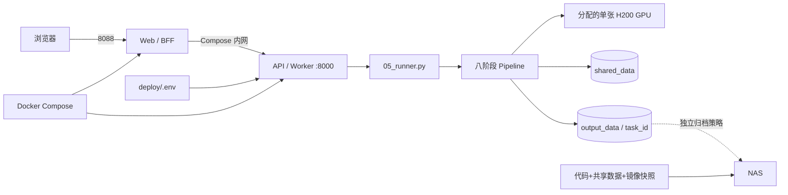

# 量化平台交接手册

面向第一次接手本项目的同事。读完后应能回答五个问题：平台解决什么问题、服务在哪里、数据在哪里、一次任务怎样流转、出现故障时从哪里开始。

## 1. 项目背景：什么是模型量化

训练得到的 PyTorch 模型通常以浮点形式运行，精度高但计算和存储成本较大。量化的目标是把模型转换成更适合部署硬件的表示，并用标定集确定数值范围，再用测试集检查转换前后的效果是否可接受。

本平台不是单纯执行一次格式转换，而是一条完整交付流水线：

1. `pt_eval`：评估原始 PyTorch 模型，形成基线。
2. `quantize`：生成量化相关 ONNX 和中间文件。
3. `onnx_eval`：评估量化后的 ONNX。
4. `fpga_test_pack`：生成 FPGA 测试输入和侧视数据。
5. `fpga_eval`：评估 FPGA 侧测试结果。
6. `generate_bin`：生成部署需要的分层 BIN。
7. `merge_bin`：合并最终权重和配置 BIN。
8. `bundle`：把配置、日志、结果和交付文件打成 ZIP。

标定集用于量化，不等同于测试集；测试集用于检查指标和问题样本。任务完成的判断依据不是“GPU 跑过”，而是八个阶段全部完成、无 worker/task error、最终 ZIP 存在。

最近验证过的生产状态、性能任务和证据统一见[当前状态](status/CURRENT.md)，本文不复制易过期的任务编号和耗时。

## 2. 人、机器和网络

### 2.1 机器角色

| 名称 | 稳定角色 | 连接方式 |
|---|---|---|
| 本机 Windows | 文档、Agent、SSH控制端 | 本地 |
| H200 | 当前生产量化平台 | `ssh H200`直连 |
| wrs | 旧环境和历史来源 | `ssh wrs`，仅按需追溯 |
| NAS | 冷备份和Agent文档 | SMB/CIFS |

地址、用户、系统版本和服务入口见[当前状态](status/CURRENT.md)。H200不经过wrs跳转；密码不写入文档，SSH使用本机密钥。

### 2.2 Astrill 与局域网路由

Astrill会安装覆盖范围很大的VPN路由。为了避免H200、wrs和NAS流量误入VPN，本机Windows使用更具体的持久局域网路由；当前网段、网关和接口索引见[当前状态](status/CURRENT.md#本机网络)。

Windows 路由按“最长前缀优先”选择，因此 `/24` 局域网路由会优先于 Astrill 的 `/1` 广域路由。排查连接时先看路由和 TCP 端口，不要把 IP 直连问题误判成 DNS 问题。

常用检查：

```powershell
Find-NetRoute -RemoteIPAddress 10.2.29.180
Test-NetConnection 10.2.29.180 -Port 22
ssh -o BatchMode=yes H200 "whoami; hostname"
```

## 3. H200服务器基线

当前OS、内核、CPU、内存、GPU、驱动和运行镜像见[当前状态](status/CURRENT.md#硬件与运行环境)。这些是观察值，不写入稳定交接说明。

`ywang` 在 Docker 组内，Docker 权限等价于高权限。H200 是公用服务器，GPU、CPU、磁盘和系统包都可能被其他用户使用。不要因为一张卡瞬时利用率为 0 就认为它空闲；还要看显存、进程和连续采样。

## 4. 数据和文件在哪里

### 4.1 本机 Windows

```text
<repository-root>\
├── README.md                 # 人类总入口
├── AGENTS.md                 # Agent 总入口
├── docs\                     # 当前交接、Agent 和参考文档
├── apps\、pipeline\          # 平台服务和量化流水线
├── deploy\                   # Compose 与镜像构建配置
└── rebuild\                  # 环境重建清单与校验脚本
```

### 4.2 H200

```text
/data3/ywang/quantitize-platform/
├── apps/api/                 # API、任务管理和 worker
├── apps/web/                 # Web 界面/BFF
├── pipeline/                 # 八阶段 runner 和量化逻辑
├── deploy/                   # Compose、Dockerfile、GPU 配置
├── rebuild/                  # 可重建环境证据
└── data/
    ├── shared_data/          # 标定集、测试集等共享输入，约 11GB
    └── output_data/          # 每个任务的工作目录和历史结果，持续增长
```

任务目录通常为：

```text
data/output_data/<task_id>/
├── job_config.json
├── manifest.json             # 总状态和阶段状态
├── input/                    # 该任务冻结后的模型与输入
├── logs/                     # 阶段日志
├── results/                  # PT/ONNX/FPGA 指标和样例
├── workspace/                # ONNX、BIN 等中间产物
├── fpga_test_pack/           # 大体积 FPGA 测试数据
└── <task_id>_quantized_bundle.zip
```

`output_data` 是容量增长最快的目录。系统备份明确不包含它；后续应通过单独的历史归档和保留策略迁移到 NAS，不能与系统恢复快照混在一起。

### 4.3 NAS

NAS用于系统冷备份和独立的历史输出归档。当前共享地址、挂载点、持久性和最新已验证快照见[当前状态](status/CURRENT.md#存储与备份)。系统快照包含项目、`shared_data`、镜像、环境包、重建清单和恢复手册，不包含`output_data`。

## 5. 平台架构



核心关系：

- 宿主机 `8088` 是用户入口，`8000` 是 API。
- Web 通过 Compose 服务名访问 API，不直接执行量化。
- API 维护任务状态并启动一个 worker；runner 顺序执行八个阶段。
- API 镜像约 21GB，内含原始 yolov8/量化运行环境；Web 镜像较轻。
- `apps/api`、`pipeline`、`shared_data` 和 `output_data` 通过 bind mount 进入 API 容器，代码修改无需重建 21GB 镜像。
- `deploy/.env` 使用物理 GPU UUID。容器中被分配的物理 GPU 会显示为逻辑 GPU 0。
- GPU readiness 会检查空闲显存和利用率；API/Web 可以健康，但任务可能处于 `waiting_gpu`。

## 6. 日常使用

### 6.1 打开平台

浏览器入口以[当前状态](status/CURRENT.md#生产服务)为准。

创建任务时确认模型、标定集、测试集和预处理方式。不要重复启动已经 `running` 的任务。

### 6.2 查看服务和任务

```bash
ssh H200
cd /data3/ywang/quantitize-platform
docker compose -f deploy/docker-compose.yml ps
curl -fsS http://127.0.0.1:8000/health
curl -fsS http://127.0.0.1:8000/ready
curl -fsS http://127.0.0.1:8088/health
```

查询具体任务：

```bash
curl -fsS http://127.0.0.1:8000/api/tasks/<task_id> | python3 -m json.tool
```

重点字段：`status`、`worker_status`、`task_error`、`worker_error`、`manifest.steps` 和 `has_zip`。

### 6.3 查看 GPU

```bash
nvidia-smi
nvidia-smi --query-gpu=index,uuid,memory.used,memory.free,utilization.gpu,power.draw --format=csv
nvidia-smi dmon -s pucm -c 5
```

正式任务前要确认：分配 UUID 正确、显存满足门槛、没有与其他用户冲突。不要停止不属于自己的进程。

### 6.4 重启服务

普通重启不需要从 NAS 恢复：

```bash
ssh H200
cd /data3/ywang/quantitize-platform
docker compose -f deploy/docker-compose.yml up -d --no-build
docker compose -f deploy/docker-compose.yml ps
curl -fsS http://127.0.0.1:8000/health
curl -fsS http://127.0.0.1:8088/health
```

禁止使用 `docker compose down -v`。

## 7. 怎样判断任务成功

同时满足：

- API 总状态为 `completed`。
- 八个 `manifest.steps` 全部为 `completed`。
- `worker_error` 和 `task_error` 为空。
- `has_zip=true`，最终 bundle ZIP 存在。
- PT、ONNX、FPGA 评估报告存在且指标在业务容差内。

`quantize: pending` 只表示阶段尚未完成并写回 manifest；若 `quantitize.py` 进程仍在消耗 CPU，量化可能正在进行。当前量化引擎大量使用 CPU，GPU 利用率低不一定代表卡住。

## 8. 性能信息

不要只根据GPU型号估算任务时间。当前性能摘要见[当前状态](status/CURRENT.md#最近性能基线)，测试方法和验收门禁见[性能验证规则](reference/PERFORMANCE.md)，完整历史结果通过状态文件引用对应的不可变证据。

## 9. 故障分流

| 现象 | 首先检查 | 继续阅读 |
|---|---|---|
| 浏览器打不开 | Windows 路由、端口 8088、Compose 状态 | 本文第 2、6 节 |
| API 健康但任务不启动 | `/ready`、GPU UUID、空闲显存、其他用户进程 | `agent/RUNBOOK.md` |
| 任务失败 | API 错误字段、任务日志、最后完成阶段 | `agent/RUNBOOK.md` |
| H200 重启 | Docker、GPU、Compose、health | `reference/RECOVERY.md` |
| 系统重装或 `/data3` 丢失 | NAS 快照校验、镜像加载、项目恢复 | `reference/RECOVERY.md` |
| 镜像损坏或平台变更 | 镜像 → Conda 包 → 依赖清单三级恢复 | `../rebuild/REBUILD_GUIDE.md` |

## 10. 下一步阅读

- 需要让 Agent 协助：读 [AGENT_GUIDE.md](AGENT_GUIDE.md)。
- 需要执行故障恢复：读 [reference/RECOVERY.md](reference/RECOVERY.md)。
- 需要优化耗时：读 [reference/PERFORMANCE.md](reference/PERFORMANCE.md)。
- 需要适配 21 类模型：读 [class-21/01_人类阅读_21类模型适配分析与计划.md](class-21/01_人类阅读_21类模型适配分析与计划.md)。
